# Telomere_expand
telomere expand pipeline
## Introduction

This software is used for expand telomere.

## Overview
### Telomere Expansion Workflow

```mermaid
flowchart TD
    A[Extract ≥4 monomer] 
    --> B[VGP/seqtk filter]
    --> C{Telomere-lacking chr?}
    C -->|Yes| D[Align to chr ends]
    C -->|No| X([End])
    D --> E[Select best alignment]
    E --> F[Expand chr]
    F --> G([Complete])
```




## Dependencies

Software:

- [seqkit](https://bioinf.shenwei.me/seqkit/)
- [seqkt](https://github.com/lh3/seqtk/)
- [TGS-GapCloser](https://github.com/BGI-Qingdao/TGS-GapCloser)
- [minimap2](https://github.com/lh3/minimap2)
- [vgp-assembly (telomere module)](https://github.com/zskey-zn/vgp-assembly/tree/master/pipeline/telomere)
- [sdust](https://github.com/lh3/sdust)

> **Notice:** these software should be fix in `bin/software` file.

## Usage

### 1. Modify configuration file(`example/conf.txt`)

Please refer to the sample file. For details, please refer to the "example" directory
```
genome=$Your_PATH/example/genome.fa  #must be .fasta or .fa ,cannot be compressed
asm=$Your_PATH/example/ont_read.fa  #can be hifi/ont reads and other assembly;must be .fasta or .fa,cannot be compressed
telomere_monomer=CCCTAA  #The telomere monomer should be the positive monomer of the head chromosome (5')
sp=test  #species name
#a/p/f. a is animal,p is plant,f is fungi.
category=a
#map-hifi for hifi reads;map-ont for ont reads;asm5 for contigs
map_para=map-ont  
```
> **Notice:** Bases must be in uppercase.

### 2. Process script generation and execution

Run `python telomere_expand_pipeline.py conf.txt` to generate the execution script and `shell.list`.

If you have access to a cluster (SGE or Slurm), submit the jobs using qsub or sbatch according to shell.list. Otherwise, run the steps sequentially using shell.list as a guide.
